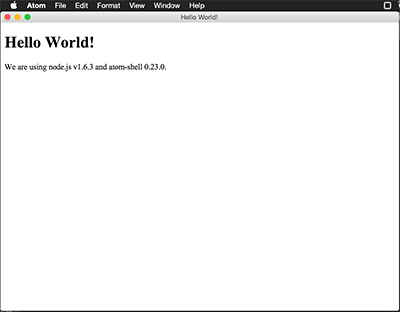

# lein-template-descjop

A Leiningen template for Web based desktop application with Electron(atom-shell) and others.
(now Electron(atom-shell) based only. will build nw.js based later...)

**Website : [descjop.org/](http://descjop.org/)**

[](http://clojars.org/descjop/lein-template)

## Requirements

- leiningen 2.6.x + 
- node v6.x +
- grunt v0.1.13 +

**important : not support leiningen 2.5.x**

### (If not already installed grunt.)

```
$ npm install -g grunt-cli
```

## Help

You can display help how to use descjop.

```
$ lein new descjop help
```

and you can use alias in project directory.

```
$ lein descjop-help
```

## display latest version

You can display latest version.

```
$ lein new descjop version
```

## New project from leiningen template

### Minimum project

```
$ lein new descjop YOUR_APP_NAME
$ cd YOUR_APP_NAME
```

### [Om](https://github.com/omcljs/om) based project

```
$ lein new descjop YOUR_APP_NAME +om
$ cd YOUR_APP_NAME
```

### [reagent](https://github.com/reagent-project/reagent) based project

```
$ lein new descjop YOUR_APP_NAME +reagent
$ cd YOUR_APP_NAME
```

## Project Directory

see your app dir. looks like

```
.
+-- Gruntfile.js
+-- README.md
+-- app
|   +-- dev // deveropment mode dir
|   |   +-- index.html // entry html file
|   |   +-- js
|   |   |   +-- externs_front.js
|   |   |   +-- externs.js
|   |   |   +-- main.js
|   |   +-- package.json // for Desktop app
|   +-- prod // production mode dir
|       +-- index.html // entry html file
|       +-- js
|       |   +-- externs_front.js
|       |   +-- externs.js
|       |   +-- main.js
|       +-- package.json // for Desktop app
+-- package.json // for Compile
+-- project.clj // compile settings desktop app
+-- resources
+-- src
|   +-- NAMESPACE
|       +-- core.cljs // ClojureScript for Electron in here
+-- src_front
|   +--NAMESPACE_front
|      +-- core.cljs // Frontend clojureScript in here
+-- src_front_profile
    +--NAMESPACE_front
       +-- dev
       |   +-- conf.cljs
       |   +-- init.cljs
       +-- prod
           +-- conf.cljs
           +-- init.cljs
```

## Usage

### step 1

run `descjop-init` (windows user should use `descjop-init-win`) alias below.

#### OSX/Linux user

```
$ lein descjop-init
 ...
 
Running "download-electron" task
 
Done, without errors.
```

#### Windows user

```
$ lein descjop-init-win
 ...
 
Running "download-electron" task
 
Done, without errors.
```

### step 2

you have to change `src/PROJECT_NAME/core.cljs` about `:companyName` and `submitURL`.

```
(defn -main []
  (.start crash-reporter (clj->js {:companyName "Your Company Name"
                                   :submitURL   "http://example.com/"}))
  ...
```

### step 3

and run extern alias `descjop-externs`,

```
$ lein descjop-externs
```

run cljsbuild `lein descjop-once`.

```
$ lein descjop-once

Compiling ClojureScript.
Compiling "app/js/cljsbuild-main.js" from ["src"]...
Successfully compiled "app/js/cljsbuild-main.js" in 10.812 seconds.
...
Successfully compiled "app/dev/js/front.js" in 10.588 seconds.
...
Successfully compiled "app/prod/js/cljsbuild-main.js" in 19.333 seconds.
...
Successfully compiled "app/prod/js/front.js" in 29.94 seconds.
```

### step 4

You can run Desktop application.

#### development mode

development mode use figwheel. run alias `descjop-figwheel`.  before run application.
Open other terminal window.

```
$ lein descjop-figwheel
```

and you can run Electron(Atom-Shell) app.

On Windows:

```
$ .\electron\electron.exe app/dev
```

On Linux:

```
$ ./electron/electron app/dev
```

On OS X:

```
$ ./electron/Electron.app/Contents/MacOS/Electron app/dev
```

#### production mode

you can run Electron(Atom-Shell) app.

On Windows:

```
$ .\electron\electron.exe app/prod
```

On Linux:

```
$ ./electron/electron app/prod
```

On OS X:

```
$ ./electron/Electron.app/Contents/MacOS/Electron app/prod
```

## Package App

### (If not already installed Electron-packager.)

```
$ npm install -g electron-packager
```

### run command

#### for OSX

```
$ lein descjop-uberapp-osx
```

#### for OSX app store

```
$ descjop-uberapp-app-store
```

#### for windows 32bit app

```
$ descjop-uberapp-win32
```

#### for windows 64bit app

```
$ descjop-uberapp-win64
```

#### for linux

```
$ descjop-uberapp-linux
```

## How to Upgrade to new Electron version

You can change Electron version in Gruntfile.js.

```
module.exports = function(grunt) {

    grunt.initConfig({
        pkg: grunt.file.readJSON('package.json'),
        "download-electron": {
            version: "1.3.2", // change Electron version 1.3.2 -> 1.3.3
            outputDir: "./electron", 
            rebuild: true
        }
    });

    grunt.loadNpmTasks('grunt-download-electron');

};
```

and re-run

for linux / mac

```
$ lein descjop-init
```

for windows

```
$ lein descjop-init-win
```


## Aliases

you can use aliases in project directory.

```
$ lein descjop-version       # descjop version
$ lein descjop-help          # descjop help
$ lein descjop-init          # init project
$ lein descjop-init-win      # init project for windows user
$ lein descjop-externs       # output externs for develop and production
$ lein descjop-externs-dev   # output externs for develop
$ lein descjop-externs-prod  # output externs for production
$ lein descjop-figwheel      # start figwheel
$ lein descjop-once          # build JavaScript for develop and production
$ lein descjop-once-dev      # build JavaScript for develop
$ lein descjop-once-prod     # build JavaScript for production
```



## Milestones

- descjop cli command
- add CSS
- test suite

## Change log

### 0.7.2 (2017-05-10)

- update electron -> `1.6.6`
- fix package build alias

### 0.7.1 (2017-02-21)

- update Readme.txt for Upgrading Electron version.

### 0.7.0 (2017-02-14)

- update electron -> `1.6.0`
- update clojurescript 1.7.228 -> 1.9.473
- some :dependencies update
- add electron packager command
    - descjop-uberapp-osx
    - descjop-uberapp-app-store
    - descjop-uberapp-linux
    - descjop-uberapp-win64
    - descjop-uberapp-win32

### 0.6.6 (2016-08-11)

- update electron -> `1.3.3`

### 0.6.5 (2016-07-17)

- add descjop command version alias `lein descjop-version`
- update electron -> `1.2.7`

### 0.6.4 (2016-07-07)

- update electron -> `1.2.5`

### 0.6.3 (2016-04-11)

- fixed namespace problem.

### 0.6.2 (2016-04-10)

Changes:

- update clojurescript 1.7.122 -> 1.7.228
- update electron -> `0.37.5`
- add descjop command help alias `lein descjop-help`
- add descjop command init alias `lein descjop-init`
- add descjop command externs alias `lein descjop-externs` `lein descjop-externs-dev` `lein descjop-externs-prod`
- add descjop command compile alias `lein descjop-once` `lein descjop-once-dev` `lein descjop-once-prod`
- add descjop command figwheel alias `lein descjop-figwheel`
- support development and production mode.
- re-design directories.
- some bug fix

### 0.5.4 (2015-12-29)

Changes:

- update document
- update electron -> `0.36.1`
- update lein-cljsbuild -> `1.1.2`
- update lein-externs -> `0.1.5`

### 0.5.3 (2015-12-19)

Changes:

- update electron -> `0.36.1`
- change deprecated method `.loadUrl()` to `.loadURL()`
- add `downloadDir` Gruntfile settings. if you want to download electron on current project directory. 
- delete `atom-shell` in `app__index.html`
- change `.gitignore` exclude `electron/*`
- change `crash-reporter.start()` in `resources/leiningen/new/descjop/src__core.cljs` that require `companyName` and `submitURL`

### 0.5.2 (2015-11-19)

Changes:

- update electron -> 0.35.0

### 0.5.1 (2015-10-22)

Changes:

- update electron -> 0.34.0
- update clojurescript -> 1.7.145

### 0.5.0 (2015-10-09)

Changes:

- [om](https://github.com/omcljs/om) also support figwheel. great job [@dvcrn](https://github.com/dvcrn)!
- update electron -> 0.33.6

### 0.4.0 (2015-09-29)

Changes:

- [reagent](https://github.com/reagent-project/reagent) support (with figwheel). good job [@mopemope](https://github.com/mopemope)!
- update electron -> 0.33.3

### 0.3.2 (2015-09-19)

Changes:

- add help command
- update electron -> 0.33.0

### 0.3.1 (2015-09-10)

Changes:

- update electron -> 0.32.2


### 0.3.0 (2015-09-05)

Changes:

- add +om option. [Om](https://github.com/omcljs/om) based template support.

### 0.2.1 (2015-09-03)

Changes:

- update clojurescript -> 1.7.48
- update electron -> 0.31.2
- update grunt-download-electron -> 2.1.2

### 0.2.0 (2015-08-03)

Changes:

- support :optimization :none
- update clojure -> 1.7.0
- update clojurescript -> 1.7.28
- update electron -> 0.30.2

### 0.1.8 (2015-06-22)

Changes:

- update Electron version 0.28.1 to 0.28.2

### 0.1.7 (2015-06-16)

Changes:

- update Electron version 0.27.3 to 0.28.1

### 0.1.6 (2015-06-08)

Changes:

- update Electron version 0.26.1 to 0.27.3

### 0.1.5 (2015-05-22)

Changes:

- update Electron version 0.26.0 to 0.26.1

### 0.1.4 (2015-05-16)

Changes:

- update Electron version 0.25.3 to 0.26.0

### 0.1.3 (2015-05-08)

Changes:

- update Electron version 0.24.0 to 0.25.3
- update grunt-download-electron to 2.1.1

### 0.1.2 (2015-04-22)

Bugfixes:

- change calling how to index.html path (#2, @karad)

### 0.1.1 (2015-04-20)

Bugfixes:

- change grunt task from atom-shell to electron (#1, @karad)

## License

Copyright ©  Kazuhiro Hara (Greative LLC http://greative.jp/)
{:mail kazuhiroh@gmail.com
 :twitter https://twitter.com/kara_d}

Distributed under the MIT License http://opensource.org/licenses/MIT .

## Thanks

- [@kara_d](https://github.com/karad/)
- [@mopemope](https://github.com/mopemope)
- [@dvcrn](https://github.com/dvcrn)
- [@toku345](https://github.com/toku345)
- [@qinxij](https://github.com/qinxij)

